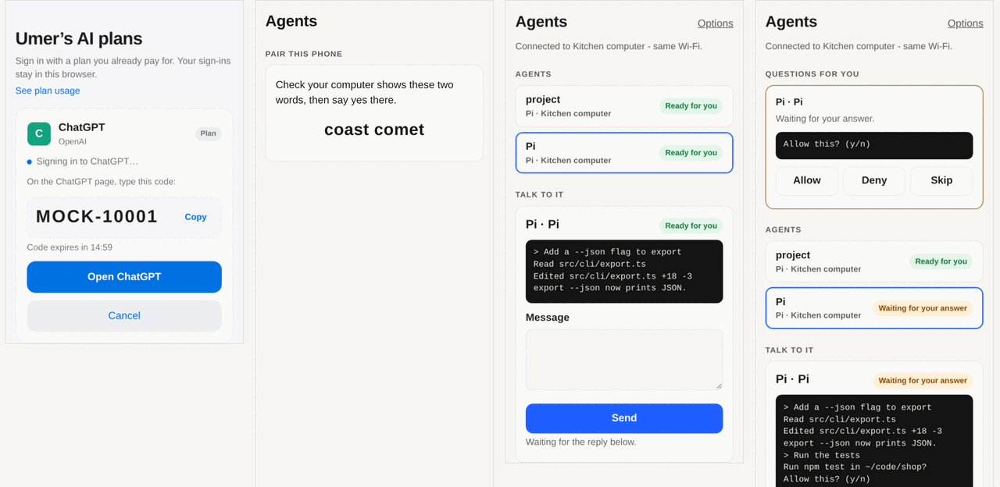
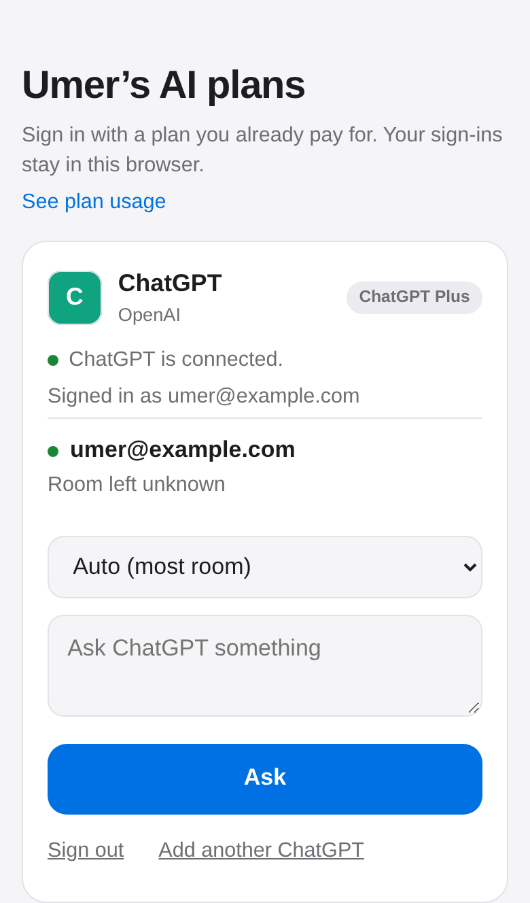
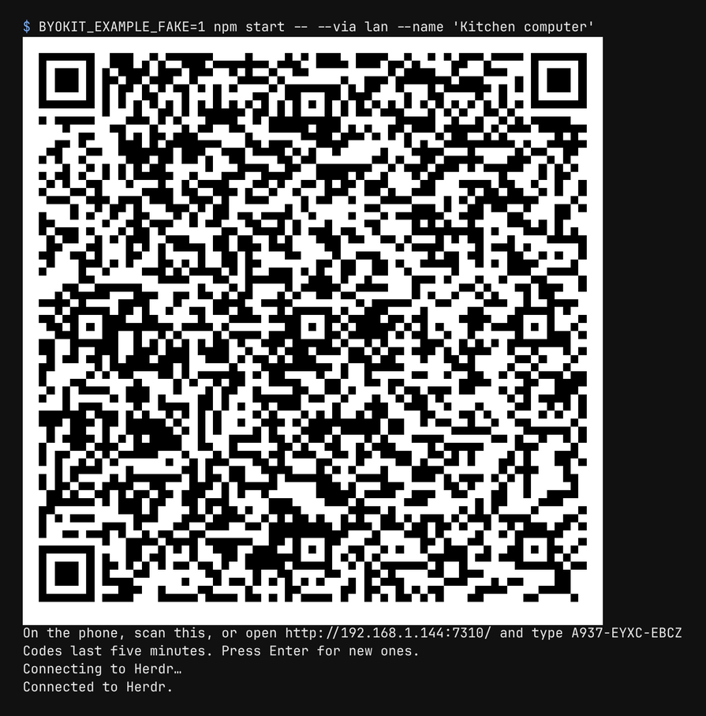

<h1 align="center">byokit</h1>

<p align="center">
  <a href="https://www.npmjs.com/org/byokit"></a>
  <a href="https://github.com/umeranjum17/byokit/actions/workflows/ci.yml"></a>
  <a href="LICENSE"></a>
  
</p>

<p align="center">
  <strong>Bring your own AI plan and devices.</strong><br/>
  byokit is a set of TypeScript packages for apps that run on the person's own AI plan and their own devices. Sign in
  with the ChatGPT plan they already pay for, pair their phone with their computer over one encrypted link, and let the
  phone drive what runs at home. Credentials stay on the person's own devices, in your app's own store, including an
  optional cloud computer they rent on their own account: byokit operates no service, and that machine is still their
  own hosting.
</p>

<h3 align="center"><a href="#quickstart"><ins>Get started</ins></a></h3>

<p align="center">
  <a href="#install">Install</a> ·
  <a href="#packages">Packages</a> ·
  <a href="examples">Examples</a> ·
  <a href="docs/runtime-kits.md">Runtime kits</a> ·
  <a href="docs/capability-kits.md">Capability kits</a> ·
  <a href="docs/cloud-kit.md">Cloud kit</a> ·
  <a href="docs/kit-conventions.md">Kit conventions</a> ·
  <a href="CONTRIBUTING.md">Contributing</a>
</p>

<p align="center">
  <br/>
  <sub>Captured with headless Chromium from <a href="examples/pwa"><code>examples/pwa</code></a> and <a href="examples/herdr-kit"><code>examples/herdr-kit</code></a>, against the kit's stand-in OpenAI and Herdr.</sub>
</p>

## Install

Every published package is on npm and ships a per-package GitHub release tagged `<pkg>-v<version>`.
The badges below always show the current version; each release link lists that package's releases with the
latest first, so neither goes stale.

| Package | Install | npm | Latest release |
|---|---|---|---|
| `@byokit/accounts` | `npm install @byokit/accounts` | [](https://www.npmjs.com/package/@byokit/accounts) | [accounts-v releases](https://github.com/umeranjum17/byokit/releases?q=accounts-v) |
| `@byokit/ui` | `npm install @byokit/ui` | [](https://www.npmjs.com/package/@byokit/ui) | [ui-v releases](https://github.com/umeranjum17/byokit/releases?q=ui-v) |
| `@byokit/seal` | `npm install @byokit/seal` | [](https://www.npmjs.com/package/@byokit/seal) | [seal-v releases](https://github.com/umeranjum17/byokit/releases?q=seal-v) |
| `@byokit/pair` | `npm install @byokit/pair` | [](https://www.npmjs.com/package/@byokit/pair) | [pair-v releases](https://github.com/umeranjum17/byokit/releases?q=pair-v) |
| `@byokit/link` | deprecated, renamed to `@byokit/pair` | [](https://www.npmjs.com/package/@byokit/link) | [link-v releases](https://github.com/umeranjum17/byokit/releases?q=link-v) |
| `@byokit/relay` | `npm install @byokit/relay @byokit/pair` | [](https://www.npmjs.com/package/@byokit/relay) | [relay-v releases](https://github.com/umeranjum17/byokit/releases?q=relay-v) |
| `@byokit/discover` | `npm install @byokit/discover` | [](https://www.npmjs.com/package/@byokit/discover) | [discover-v releases](https://github.com/umeranjum17/byokit/releases?q=discover-v) |
| `@byokit/decide` | `npm install @byokit/decide` | [](https://www.npmjs.com/package/@byokit/decide) | [decide-v releases](https://github.com/umeranjum17/byokit/releases?q=decide-v) |
| `@byokit/connect` | `npm install @byokit/connect` | [](https://www.npmjs.com/package/@byokit/connect) | [connect-v releases](https://github.com/umeranjum17/byokit/releases?q=connect-v) |
| `@byokit/secrets` | `npm install @byokit/secrets` | [](https://www.npmjs.com/package/@byokit/secrets) | [secrets-v releases](https://github.com/umeranjum17/byokit/releases?q=secrets-v) |
| `@byokit/mcp` | `npm install @byokit/mcp` | [](https://www.npmjs.com/package/@byokit/mcp) | [mcp-v releases](https://github.com/umeranjum17/byokit/releases?q=mcp-v) |
| `@byokit/realtime` | `npm install @byokit/realtime` | [](https://www.npmjs.com/package/@byokit/realtime) | [realtime-v releases](https://github.com/umeranjum17/byokit/releases?q=realtime-v) |
| `@byokit/infer` | `npm install @byokit/infer` | [](https://www.npmjs.com/package/@byokit/infer) | [infer-v releases](https://github.com/umeranjum17/byokit/releases?q=infer-v) |
| `@byokit/herdr` | `npm install @byokit/herdr` | [](https://www.npmjs.com/package/@byokit/herdr) | [herdr-v releases](https://github.com/umeranjum17/byokit/releases?q=herdr-v) |
| `@byokit/openclaw` | `npm install @byokit/openclaw` | [](https://www.npmjs.com/package/@byokit/openclaw) | [openclaw-v releases](https://github.com/umeranjum17/byokit/releases?q=openclaw-v) |
| `@byokit/write` | `npm install @byokit/write` | [](https://www.npmjs.com/package/@byokit/write) | [write-v releases](https://github.com/umeranjum17/byokit/releases?q=write-v) |
| `@byokit/record` | `npm install @byokit/record` | [](https://www.npmjs.com/package/@byokit/record) | [record-v releases](https://github.com/umeranjum17/byokit/releases?q=record-v) |
| `@byokit/bubble` | `npm install @byokit/bubble` | [](https://www.npmjs.com/package/@byokit/bubble) | [bubble-v releases](https://github.com/umeranjum17/byokit/releases?q=bubble-v) |
| `@byokit/cloud` | not on npm (private) — build from source: `npm ci && npm run build` | in development | [all releases](https://github.com/umeranjum17/byokit/releases) |
| `@byokit/share` | build from source (private pending qualification) | in qualification | — |
| `@byokit/statusbar` | `npm install @byokit/statusbar` | [](https://www.npmjs.com/package/@byokit/statusbar) | [statusbar-v releases](https://github.com/umeranjum17/byokit/releases?q=statusbar-v) |
| `@byokit/signaling` | `npm install @byokit/signaling` | [](https://www.npmjs.com/package/@byokit/signaling) | [signaling-v releases](https://github.com/umeranjum17/byokit/releases?q=signaling-v) |
| `@byokit/approve` | not on npm (private until release) | exact-action approval | [all releases](https://github.com/umeranjum17/byokit/releases) |
| `@byokit/push` | not on npm (private) — build from source | native pre-display sealed notices | [all releases](https://github.com/umeranjum17/byokit/releases) |
| `@byokit/dictation` | `npm install @byokit/dictation` | [](https://www.npmjs.com/package/@byokit/dictation) | [dictation-v releases](https://github.com/umeranjum17/byokit/releases?q=dictation-v) |
| `@byokit/audio` | `npm install @byokit/audio` | [](https://www.npmjs.com/package/@byokit/audio) | [audio-v releases](https://github.com/umeranjum17/byokit/releases?q=audio-v) |
| `@byokit/usage` | `npm install @byokit/usage` | [](https://www.npmjs.com/package/@byokit/usage) | [usage-v releases](https://github.com/umeranjum17/byokit/releases?q=usage-v) |
| `@byokit/browser` | `npm install @byokit/browser` | [](https://www.npmjs.com/package/@byokit/browser) | [browser-v releases](https://github.com/umeranjum17/byokit/releases?q=browser-v) |
| `@byokit/ui-core` | deprecated, renamed to `@byokit/ui` | [](https://www.npmjs.com/package/@byokit/ui-core) | [ui-core-v releases](https://github.com/umeranjum17/byokit/releases?q=ui-core-v) |
| `@byokit/reach` | deprecated, renamed to `@byokit/discover` | [](https://www.npmjs.com/package/@byokit/reach) | [reach-v releases](https://github.com/umeranjum17/byokit/releases?q=reach-v) |
| `@byokit/overlay` | deprecated, renamed to `@byokit/bubble` | [](https://www.npmjs.com/package/@byokit/overlay) | [overlay-v releases](https://github.com/umeranjum17/byokit/releases?q=overlay-v) |

Unpacked sizes as of accounts 0.20.0, decide 0.6.4, herdr 0.7.2, pair 0.9.0, relay 0.6.0, seal 0.3.0,
ui-core 0.6.0 (npm `dist.unpackedSize`): accounts ~1.3 MB, decide ~200 kB, herdr ~432 kB, pair ~240 kB,
relay ~151 kB, seal ~49 kB, ui-core ~75 kB. Each tarball's sha512 integrity is published with the
release on npm — see its npm page, or run `npm view @byokit/<pkg> dist.unpackedSize dist.integrity dist.tarball`.

The [`examples/`](examples) apps are not published artifacts: run them from a clone (see
[Quickstart](#quickstart)). For every release across packages, see
[releases](https://github.com/umeranjum17/byokit/releases).

## Why byokit exists

People already pay for an AI plan, and they already carry a phone. An app that wants to use either usually asks for an
API key billed per use, or runs everything through its own servers. byokit is the other way: the person signs in with
their subscription inside your app, the sign-in is kept where your app keeps its data, and their phone talks to their
own computer, which holds every credential.

Every provider is labelled with how it is billed. Subscription sign-ins are offered by default; API-billed ones only
when an app chooses to offer them.

## See it in action

### Sign in with the plan you already pay for

`@byokit/accounts` signs a person in by device code in a browser or on a phone (ChatGPT on its own flow; Grok and Kimi from catalogue device data), and with ChatGPT's and Gemini Code Assist's own pages
on a computer. Every state is one plain sentence your app can show.

<p align="center">
  
  <br/>
  <sub><a href="examples/pwa"><code>examples/pwa</code></a> in headless Chromium, signed in against the stand-in OpenAI (<code>mockOpenAI()</code>).</sub>
</p>

### Pair a phone with one scan

`@byokit/pair` pairs a phone or browser with the computer from a QR code or a typed code, then carries requests and
streams over one end-to-end encrypted link. Both screens show the same two words before the person says yes.

<p align="center">
  <br/>
  <sub>The host of <a href="examples/herdr-kit"><code>examples/herdr-kit</code></a> (<code>npm start -- --herdr "$(command -v herdr)" --via lan --name 'Kitchen computer'</code>), pictured against the kit's stand-in Herdr (<code>BYOKIT_EXAMPLE_FAKE=1</code>); the phone's side of the pairing, the two words, is the second screen at the top.</sub>
</p>

### Drive the agents at home from the phone

`@byokit/herdr` drives the Herdr on the computer: start a coding agent, send it a message, and answer it when it stops
to ask. Each agent keeps its own subscription sign-in; the kit never sees a credential.

<p align="center">
  <br/>
  <sub>After answering the question in the last screen at the top: <a href="examples/herdr-kit"><code>examples/herdr-kit</code></a>'s end-to-end test in a phone-sized headless Chromium, against the kit's stand-in Herdr.</sub>
</p>

### And the parts in between

- **Decide, don't guess.** `@byokit/decide` turns typed questions into a typed answer with a confidence, and abstains
  below a floor so your app asks the person instead.
- **Reach the computer.** `@byokit/discover` finds the addresses a phone can dial (Tailscale Serve, the tailnet, the home
  network) and `@byokit/relay` routes link frames when there is no direct path, without being able to read them.
- **Keep data sealed.** `@byokit/seal` is portable NaCl-compatible box, secretbox and signatures for data at rest.
- **Your own look.** `@byokit/ui` is the headless state behind the screens above: sign-in phases, the pairing
  QR, consent and status words.

## Packages

| Package | What it does | npm |
|---|---|---|
| [`@byokit/accounts`](packages/accounts) | Sign in with the AI plan you already pay for, into your app's own store; limits, refresh, plain words. Node, Electron, browsers and PWAs, React Native on iOS and Android | [](https://www.npmjs.com/package/@byokit/accounts) |
| [`@byokit/ui`](packages/ui) | Headless sign-in and pairing state for any UI (React, React Native, or none): phases, QR, consent, link words, route labels | [](https://www.npmjs.com/package/@byokit/ui) |
| [`@byokit/signaling`](packages/signaling) | Portable bridge WebSocket requests, typed session events and fresh authorization sockets | [](https://www.npmjs.com/package/@byokit/signaling) |
| [`@byokit/mcp`](packages/mcp) | Hosted streamable HTTP tools and resources, with device sign-in and authenticated sessions | [](https://www.npmjs.com/package/@byokit/mcp) |
| [`@byokit/realtime`](packages/realtime) | Realtime voice sessions against the engine endpoint the app selects, with host-held credentials and injected audio (Node, browsers, React Native) ([contract](docs/realtime-kit.md)) | [](https://www.npmjs.com/package/@byokit/realtime) |
| [`@byokit/approve`](packages/approve) | Exact-action approval: a grant binds to the one request naming its action, button label, app and reason, and refuses any other or mutated request | ready for first release |
| [`@byokit/seal`](packages/seal) | Portable NaCl-compatible box and secretbox for data at rest, plus Ed25519 signatures | [](https://www.npmjs.com/package/@byokit/seal) |
| [`@byokit/connect`](packages/connect) | Per-person third-party sign-in with PKCE, refresh and typed remote MCP; host-supplied keystore and redirects | [](https://www.npmjs.com/package/@byokit/connect) |
| [`@byokit/secrets`](packages/secrets) | One secret per name: OS keyring, sealed file, phone SecureStore, encrypted web storage or CI override ([spec](docs/capability-kits.md)) | [](https://www.npmjs.com/package/@byokit/secrets) |
| [`@byokit/pair`](packages/pair) | Scan a code to pair a phone or browser with the home computer over one encrypted link, with device stores for phones, browsers and computers; published as `@byokit/link` through 0.8.x | [](https://www.npmjs.com/package/@byokit/pair) |
| [`@byokit/relay`](packages/relay) | Routes encrypted link frames; enrolment, typed-code lookup, push ([security boundary](packages/relay/SECURITY.md)) | [](https://www.npmjs.com/package/@byokit/relay) |
| [`@byokit/discover`](packages/discover) | The addresses a phone dials the home computer on (Tailscale Serve, direct tailnet, LAN) plus mDNS advertising (Node) and browsing (React Native) | [](https://www.npmjs.com/package/@byokit/discover) |
| [`@byokit/decide`](packages/decide) | Typed questions in, a typed answer with confidence out, abstaining below a floor; rules, Jev (API-billed) or any model (the person's own ChatGPT on a phone), evals | [](https://www.npmjs.com/package/@byokit/decide) |
| [`@byokit/infer`](packages/infer) | Text generation on the phone itself (Gemini Nano where present, else a verified downloaded model); nothing sent anywhere | [](https://www.npmjs.com/package/@byokit/infer) |
| [`@byokit/openclaw`](packages/openclaw) | The OpenClaw runtime kit: the pinned engine's full operator surface as typed pass-through calls, plus plain-words helpers for members, sign-in, runs and approvals, for apps where the aggregator holds the subscriptions ([spec](docs/runtime-kits.md)) | [](https://www.npmjs.com/package/@byokit/openclaw) |
| [`@byokit/herdr`](packages/herdr) | Drive the Herdr on this computer — workspaces, panes, agents, blocked-approval answers — from an app, or hand it to a phone over a link, for apps where the aggregator holds the subscriptions ([spec](docs/runtime-kits.md)) | [](https://www.npmjs.com/package/@byokit/herdr) |
| [`@byokit/write`](packages/write) | Drafting in a person's voice with no model call: voice rules, platform limits, draft checks (fits, voice, kept the facts) and thread splits over a pinned writing engine, plus an agent CLI ([spec](docs/capability-kits.md)) | [](https://www.npmjs.com/package/@byokit/write) |
| [`@byokit/record`](packages/record) | Record a screen or a desktop and make a video, through any recorder implementing the open recorder protocol v1 the kit defines ([spec](docs/capability-kits.md)) | [](https://www.npmjs.com/package/@byokit/record) |
| [`@byokit/bubble`](packages/bubble) | A floating bubble over other apps on Android (Expo module): a panel that opens on tap, per-app visibility rules, a tap log with no text and an optional focused-field reader; iOS reports unsupported ([spec](docs/capability-kits.md)) | [](https://www.npmjs.com/package/@byokit/bubble) |
| [`@byokit/cloud`](packages/cloud) | The person's own always-on cloud computer for an app's host process: typed setup, install, cost and words, with the Boat adapter `boat()` ([spec](docs/cloud-kit.md)) | in development |
| [`@byokit/share`](packages/share) | Guarded shared text/files and generated-project native integration | in qualification |
| [`@byokit/statusbar`](packages/statusbar) | One ongoing job as a status-bar chip on Android 16 (Expo module): a counts-only lock-screen copy, up to three actions that need the phone unlocked, and a dismissal that sticks; iOS and older Android report unsupported ([spec](docs/capability-kits.md#12-byokitstatusbar)) | [](https://www.npmjs.com/package/@byokit/statusbar) |
| [`@byokit/push`](packages/push) | Opens sealed push title/body before iOS and Android display, with app-provisioned device keys ([spec](docs/capability-kits.md#13-byokitpush)) | private |
| [`@byokit/dictation`](packages/dictation) | Live partials/finals and recording transcription through injected local recognition or your own subscription ([spec](docs/dictation-kit.md)) | [](https://www.npmjs.com/package/@byokit/dictation) |
| [`@byokit/audio`](packages/audio) | Shared on-device speech detection over one pinned neural graph, for Node, React Native and browsers | [](https://www.npmjs.com/package/@byokit/audio) |
| [`@byokit/usage`](packages/usage) | Subscription usage windows and remaining room per provider and account (Node only) | [](https://www.npmjs.com/package/@byokit/usage) |
| [`@byokit/browser`](packages/browser) | PNG screenshots of URLs or local HTML through an app-selected installed Chromium, with private temporary profiles | [](https://www.npmjs.com/package/@byokit/browser) |

Renamed packages still ship as thin re-exports so existing imports keep working, and are removed at the version their
README names:

| Package | Renamed to | Kept through |
|---|---|---|
| [`@byokit/link`](packages/link) | [`@byokit/pair`](packages/pair) | 0.8.x |
| [`@byokit/ui-core`](packages/ui-core) | [`@byokit/ui`](packages/ui) | 0.7.x |
| [`@byokit/reach`](packages/reach) | [`@byokit/discover`](packages/discover) | 0.7.x |
| [`@byokit/overlay`](packages/overlay) | [`@byokit/bubble`](packages/bubble) | 0.3.x |

## Quickstart

You need [Node.js 22.18 or newer](https://nodejs.org/).

```bash
npm install @byokit/accounts
```

In a browser or PWA, sign the person in to ChatGPT and keep the sign-in in the browser's IndexedDB:

```ts
import { Accounts, browserStore } from '@byokit/accounts';

const accounts = new Accounts({ store: (member) => browserStore(`byokit.${member}`) });
const shown = await accounts.login(1, 'chatgpt'); // { state: 'waiting', via: 'code', code, url }: open url, show code
await accounts.finished(1, 'chatgpt');
(await accounts.status(1, 'chatgpt')).words;      // "ChatGPT is connected."
```

A web page can't call ChatGPT's model endpoint itself, so a PWA asks through your own server or over
[`@byokit/pair`](packages/pair). On a computer, on a phone and for asking, see [`@byokit/accounts`](packages/accounts).

### Try it with no account

`mockOpenAI()` stands in for OpenAI's sign-in and answers on loopback, so the whole flow runs with no account, no
network and no model:

```ts
import { Accounts, memoryStore } from '@byokit/accounts';
import { mockOpenAI } from '@byokit/accounts/testing';

const openai = await mockOpenAI(); // a stand-in OpenAI on loopback: no account, no network
const accounts = new Accounts({ store: () => memoryStore(), authBase: openai.base, apiBase: openai.base });

const shown = await accounts.login(1, 'chatgpt');
console.log(shown);                                  // the code and page to show the person
openai.approve(shown!.code!);                        // the person types it on the provider's page
await accounts.finished(1, 'chatgpt');
console.log((await accounts.status(1, 'chatgpt')).words);
console.log(await accounts.respond(1, { instructions: 'Answer briefly.', input: 'Plan my day' }));
await openai.close();
```

Run it as a browser or phone would (`node --conditions=browser quickstart.ts`):

```text
{
  state: 'waiting',
  via: 'code',
  url: 'http://127.0.0.1:39925/codex/device',
  code: 'MOCK-10001',
  expiresAt: 1790668740492,
  error: undefined,
  why: undefined
}
ChatGPT is connected.
You said: Plan my day
```

### Run the examples

```bash
git clone https://github.com/umeranjum17/byokit
cd byokit
npm ci
npm run build
node examples/pwa/serve.ts 8080                        # the browser sign-in page on http://127.0.0.1:8080/
cd examples/herdr-kit && BYOKIT_EXAMPLE_FAKE=1 npm start -- --via lan   # the phone page, against the stand-in Herdr
cd examples/openclaw-kit && BYOKIT_EXAMPLE_FAKE=1 npm start -- --via lan   # the phone page, against the stand-in OpenClaw
```

`examples/herdr-kit` and `examples/openclaw-kit` are not workspaces of their own: from a clone they run on the root
install's packages, as above. With a real Herdr or the real OpenClaw engine, see their READMEs
([herdr-kit](examples/herdr-kit), [openclaw-kit](examples/openclaw-kit)).

Examples: [`examples/expo`](examples/expo) (React Native, iOS and Android), [`examples/pwa`](examples/pwa)
(an installable web page), [`examples/herdr-kit`](examples/herdr-kit) (Herdr's agents from a phone browser) and
[`examples/openclaw-kit`](examples/openclaw-kit) (a ChatGPT plan's helper on the computer, from a phone browser). For
platform checks and their limits, see [CONTRIBUTING.md](CONTRIBUTING.md).

## Billing, honestly

`catalogue.json` labels every provider with its billing (`subscription` or `api`). All subscription rows are
offered on supported platforms; API-billed rows appear when the app lists them. Show `billingWords(p)` next to
every provider you list. Each provider's own terms apply to how you use your plan.
Anthropic Messages uses an app-passed API key (billed per use), with explicit opt-in on every platform.

## What byokit never touches

byokit never touches a person's other AI tools: not their `~/.pi`, `~/.codex` or `~/.claude`, not their CLIs.
Runtime kits drive only the aggregator the app names explicitly (the OpenClaw engine the kit installs, the Herdr
binary and socket the app passes); byokit tests use fakes and never a person's Herdr.
Capability kits have their own, narrower carve-out: `@byokit/write` loads only its exactly pinned public writing
engine package, and `@byokit/record` spawns a protocol-v1 recorder that the app passes by
absolute path, or the bundled Linux X11 recorder, with an environment built from nothing; `@byokit/usage` reads only the sign-in folder the app passes
and spawns only the Codex binary the app passes by absolute path, with an environment built from nothing plus what
the app passes; `@byokit/bubble`, `@byokit/statusbar` and `@byokit/push` run only their own
native code inside the app ([spec](docs/capability-kits.md)). `@byokit/share` runs only its own native code,
copies shared content into the app's cache only under the sender's grant, and its plugin edits only the generated
`settings.gradle`, `build.gradle` and pbxproj. `@byokit/cloud` spawns only the `ssh` binary the app passes by absolute path
and the `ssh-keyscan` beside it, with the key path the app passes and a kit-owned config, and holds only the provider
keys the app's store gives it and the scoped keys it mints for that app ([spec](docs/cloud-kit.md)).
`@byokit/secrets` spawns only the OS keyring CLIs by absolute path, with an environment built from nothing
plus only what the host passes ([spec](docs/capability-kits.md)).
Library code never reads environment keys; the explicitly invoked [decide eval CLI](packages/decide#evals) can use one
for a live run. The tests prove isolation; see [CONTRIBUTING.md](CONTRIBUTING.md).

## Development

```bash
git clone https://github.com/umeranjum17/byokit
cd byokit
npm ci
npm run build
npm run check
npm test
```

Tests never need an account, the network or a model. See [CONTRIBUTING.md](CONTRIBUTING.md) for platform checks,
the changelog format, releasing and pull requests.

## License

byokit is licensed under [Apache License 2.0](LICENSE). Third-party notices are recorded in [NOTICE](NOTICE).

`@byokit/realtime` dials only the engine endpoint the app selects, with the credential the app passes; provider adapters run in kit-owned child processes. Tests use loopback fakes. See [the realtime contract](docs/realtime-kit.md).
