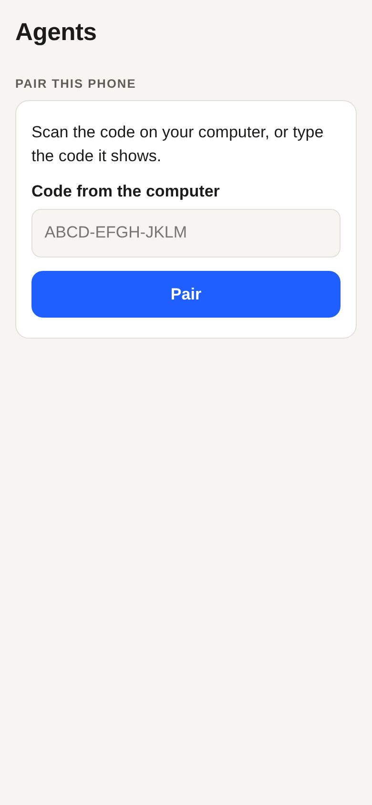
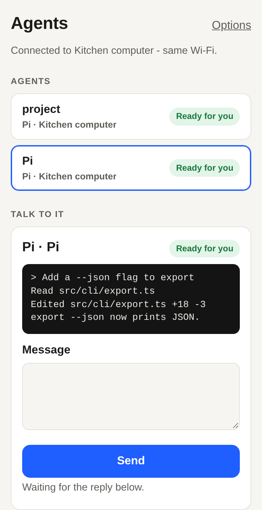
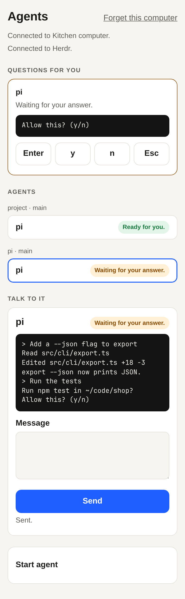
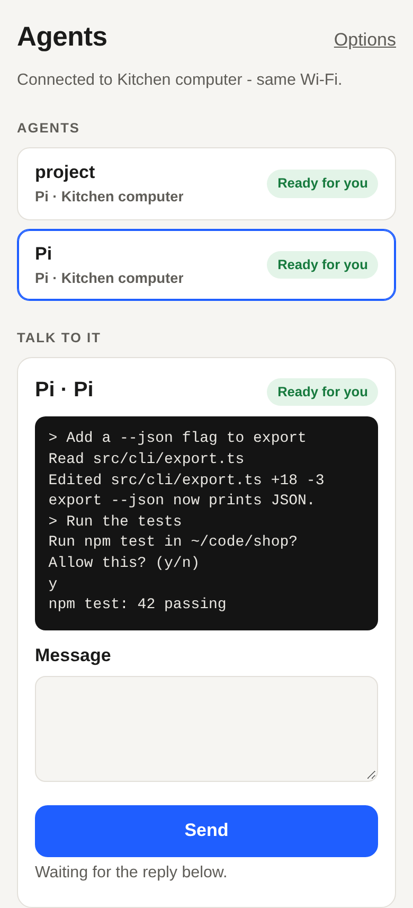

# Herdr kit example

Your coding agents in Herdr, from your phone: pair the phone with this computer, start an agent, send it a message,
and answer it when it stops to ask you something. The computer runs `host.ts` (`@byokit/herdr` in `own` mode, with
its own Herdr in `./.state`); the phone opens a plain web page this computer serves, over your home network or
Tailscale. Each agent keeps its own sign-in, made inside its own screen; this app never sees it.

| Pair | Agent at work | A question | Answered |
|---|---|---|---|
|  |  |  |  |

## Minutes to working

You need Node 22.18 or later and Herdr 0.9.1 (`curl -fsSL https://herdr.dev/install.sh | sh`, or the GitHub
release), plus at least one agent program Herdr knows, such as `pi`, `codex` or `claude`.

```sh
npm i
npm start -- --herdr "$(command -v herdr)" --path "$PATH"
```

`@byokit/herdr` is published from its first release (0.1.0); until then this folder runs from the byokit repo's
packed packages, as `e2e.test.ts` does.

1. The terminal shows a QR code and a typed code, then `Connected to Herdr.`
2. On the phone, scan the QR code with the camera (it opens this app's page), or open the address printed under it
   and type the code. Both last five minutes; press Enter in the terminal for new ones.
3. The phone and the terminal show the same two words. If they match, answer `y` in the terminal.
4. On the phone, open **Start agent**, pick an agent and the folder it works in, and tap **Start agent**.
5. The first time an agent runs here, sign in inside it: Herdr in `own` mode keeps its own home in `./.state`, so
   each agent signs in there once and stays signed in. At the computer, open this app's Herdr with
   `HERDR_SOCKET_PATH="$PWD/.state/herdr/herdr.sock" herdr` and follow the agent's own steps on its screen.
6. Type a message and tap **Send**. The agent's screen follows along under its name.
7. When the agent asks something, it appears under **Questions for you**: read its question and tap `Enter`, `y`,
   `n` or `Esc`.

Over Tailscale the page is https and the phone keeps its pairing sealed in the browser. Over your home network it is
plain http, which browsers don't let a page seal with, so the pairing is kept in the browser's ordinary storage
there; prefer Tailscale when you can.

Options: `--port` (default 7310), `--via` (`auto`: Tailscale when it is installed, else your home network; or
`tailscale`, `tailscale-direct`, `private`, `lan`), `--folder` (where new agents start; default here), `--name`
(what the phone calls this computer), `--path` (where Herdr's panes look for agent programs; default the folder
Herdr is in plus the system folders).

For a guarded lab session, provision Herdr through the lab helper first, then pass
`--socket <absolute lab socket path>` and `--herdr <absolute lab-helper wrapper path>`.
This selects the kit's `adopt` mode: restarting or stopping this example leaves the
managed session running. The wrapper must route every command through the named lab
helper. Only the helper provisions, stops and tears down that session; do not use the
own-mode commands above in a guarded lab.

Try it without Herdr: `BYOKIT_EXAMPLE_FAKE=1 npm start` runs the kit's stand-in Herdr, whose one agent answers
`fake pi: <your message>` and asks a question when you send `ask permission`.

## Away from home: a relay, and notices only the phone can read

`npm start -- … --relay https://relay.example` (a relay you run with `@byokit/relay`; add `--enrol <token>` from its
owner on the first start) makes the computer dial out to the relay, so it needs no open port. The terminal also
prints a short code for the relay, and the QR code carries the relay's address too, so a paired phone reaches the
computer from anywhere.

When an agent stops to ask something, the kit sends a notice through the relay to each phone that registered a
notice key and a push address, sealed to that phone's key. A phone app does three things (`e2e.test.ts` does them
in plain Node, as the phone):

```ts
const hd = herdrDevice(link);
await hd.registerNotices(seed);                              // a 32-byte seed only the phone keeps
await link.request('example.push', { expo: expoPushToken }); // its push address, handed to the relay
const question = hd.openNotice(push.data.data, seed);        // push.data: the notification's data; null unless sealed to it
```

What the push service got in the test run (the envelope cut short):

```json
{ "to": "ExponentPushToken[away-phone]", "collapseId": "w1:p2", "priority": "high",
  "data": { "id": "w1:p2", "title": "Waiting for your answer.", "data": { "v": 1, "sealed": "JDYdXVj_4a3tp8gl…" } },
  "title": "Waiting for your answer." }
```

The relay and the push service read the kit's generic title and the notice's id (the agent's pane; the relay sends
each id once). The question is inside `sealed`. `e2e.test.ts` fails if any of its text shows up on the wire,
or if another key opens it. This web page takes no push notices itself; a phone app does.

## What's where

- `host.ts`: `new HerdrKit({ mode: 'own', bin, stateDir: './.state' })`; a `@byokit/link` host (key in
  `.state/link-key.json`, paired phones in `.state/grants.json`, each with `meta.scope = { workspaces: 'all' }`);
  `herdrLink` answers the phone; `serve` finds the address (`@byokit/discover`) and serves the page on the same port.
  One op of its own, `example.setup`, tells the phone which agents Herdr knows (`kit.agentKinds()`) and the folder.
  With `--relay`, a `RelayClient` made once the host is open carries the kit's sealed notices, and `example.push`
  hands a phone's push address to it.
- `web/app.ts`: plain DOM. Pairs with `pairWithCode`/`pairWithOffer` and keeps the pairing in this browser
  (`browserDeviceStore`); then `herdrDevice(link)`. `@byokit/ui-core/kits`' `herdrStore(hd)` keeps the agents
  (`herdrTreeView`) and their questions (`blockedView`) live from the kit's events; `startAgent`, `prompt`, `read`
  for the agent's screen (refreshed on every change) and `answer` for questions. Every status is a sentence from the
  kit (`agentWords`, `hd.state().words`) or `@byokit/ui-core` (`pairingView`, `linkWords`).
- `e2e.test.ts`: packs the packages, installs them into a copy of this folder, runs `host.ts` against the kit's fake
  Herdr and drives a phone-sized headless Chromium through all of the above; then, through a loopback relay whose
  push service is a recorder, a phone in plain Node gets an agent's question sealed. From the repo:
  `npm run build && sh scripts/test.sh examples/herdr-kit/e2e.test.ts` (`BYOKIT_EXAMPLE_SHOTS=<folder>` keeps
  the screenshots and `relay-wire.json`, what the push service got).
- `LIVE.md`: the check with a real Herdr and a real phone, run once per kit release.

## Troubleshooting

| What you see | What to do |
|---|---|
| This computer needs Herdr installed first. | Install Herdr 0.9.1 and pass its full path: `--herdr "$(command -v herdr)"`. |
| Herdr on this computer needs an update to work with this app. | This app speaks to Herdr 0.9.1; install that version. |
| Herdr couldn't start on this computer. Restart the app to try again. | Look in `.state/herdr/server.log`. A deep folder can make Herdr's socket path too long: move this folder somewhere shorter. |
| Herdr isn't answering. Trying again by itself. | Herdr stopped; the app starts it again. If it keeps saying this, see `.state/herdr/server.log`. |
| Your computer couldn't do that. (under Start agent) | The agent program isn't where Herdr's panes look: start with `--path "$PATH"`, and check the folder exists on the computer. |
| This helper isn't ready yet. Try again in a moment. | The agent is still starting or signing in; wait until it says Ready for you. |
| That question already changed. Look again before answering. | The agent moved on before your answer arrived; read the new question and answer again. |
| This device can't do that. Ask the person at the computer. | This phone was paired to watch only; pair it again from this app's codes. |
| Can't reach your computer. Check it's on and connected. (while pairing) | Phone and computer need the same network or tailnet; check the address printed in the terminal opens on the phone. |
| Can't reach {computer} right now. This device keeps trying by itself. | The app on the computer stopped, or the phone left its network; start it again with `npm start` and the phone reconnects by itself. |
| That code didn't match. Check it, or show a new one on your computer. | Press Enter in the terminal for fresh codes and type the new one. |
| Your computer said no to this device. | Someone answered `n` in the terminal; pair again and answer `y`. |
| This device was removed on {computer}. | Its pairing was deleted from `.state/grants.json`; pair again. |
| Herdr hasn't listed its agents yet. Try again in a moment. | Herdr is still starting; if it stays, see the Herdr rows above. |
